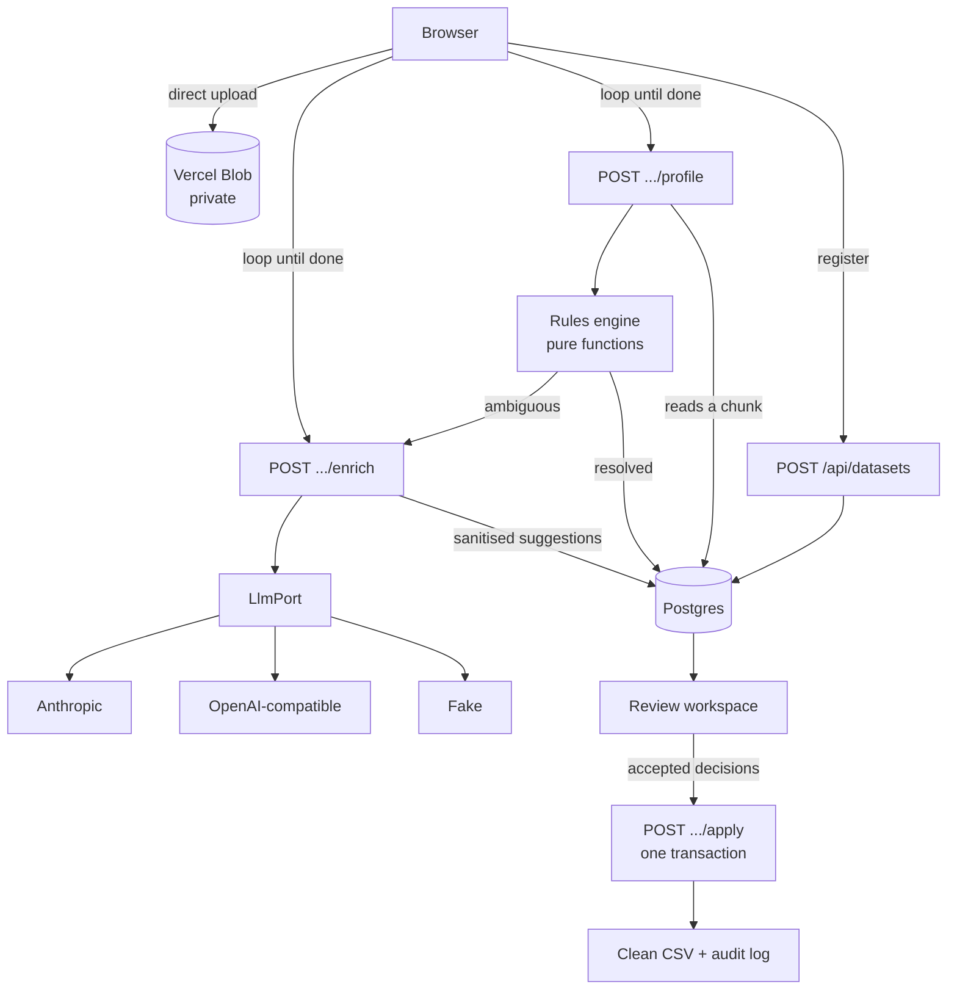

# AI Data Cleanup Assistant

Upload a messy CSV. A deterministic rules engine resolves everything it can on
its own; only the genuinely ambiguous cases reach an LLM. You review every
proposed fix — grouped by pattern, not one row at a time — then export a clean
file and a full audit log.

**Live:** https://ai-data-cleanup.vercel.app
**Demo data:** click *Load demo data* on the home page, or upload any of the
files in [`demo/`](demo/) — a messy customer list, a 1,200-row order export that
crosses the chunk boundary, a product inventory from a different domain, a set of
CSV parser edge cases, and a clean file that should come back with nothing to
fix. All generated by `scripts/`, so they never drift from the fixtures.

On the bundled demo dataset: **53 issues found, 35 resolved by rules (66%), 18
escalated to a model.** That ratio is the whole argument of the design.

> **This repo is also my AI engineering learning bench.** Because the LLM layer
> is provider-agnostic and the fixtures carry known-correct answers, models can
> be swapped and measured here. Three documents come out of that, and
> **feedback on any of them is welcome**:
>
> - [`PLAN.md`](PLAN.md) — the 6-week curriculum I am working through
> - [`EVALS.md`](EVALS.md) — measured model comparison (`npm run eval`)
> - [`LEARNING.md`](LEARNING.md) — concepts log, written as I go

---

## Running it locally

```bash
npm install
cp .env.example .env.local     # fill in the values below
npm run db:push                # creates the six tables
npm run dev
```

| Variable | Needed for |
|---|---|
| `DATABASE_URL` | Supabase **transaction pooler**, port 6543. Used at runtime. |
| `DIRECT_URL` | Supabase **session pooler**, port 5432. Used by drizzle-kit only. Not the `db.<ref>.supabase.co` direct host — that is IPv6-only on the free tier and will not resolve from most machines. |
| `BLOB_READ_WRITE_TOKEN` | Vercel Blob. `vercel env pull` writes it for you. |
| `ANTHROPIC_API_KEY` | Optional. Without it — or if the provider errors mid-run — the app falls back to a deterministic stub and still runs end to end. |

`npm test` needs none of them.

### Running it on a free model

The LLM adapter is one implementation parameterised by environment, so any
OpenAI-compatible provider works by changing two variables:

```bash
LLM_PROVIDER=openai-compatible
OPENAI_COMPATIBLE_BASE_URL=https://api.groq.com/openai/v1   # or Gemini, OpenRouter, Ollama
OPENAI_COMPATIBLE_MODEL=openai/gpt-oss-120b
OPENAI_COMPATIBLE_API_KEY=...
```

**The deployed demo runs on exactly this** — Groq's free tier, `gpt-oss-120b`.
Model choice matters more than the plumbing: on the same batch,
`llama-3.3-70b-versatile` returned `no_action` at 0.5 confidence for every fuzzy
duplicate, while `gpt-oss-120b` resolved all of them at 0.95 with a specific
reason each. Both took ~19 seconds for the full run.

`.env.example` lists the base URLs for Groq, Google Gemini's compatibility
endpoint, OpenRouter and a local Ollama.

---

## Architecture



The engine in `src/lib/profiling/` imports nothing from Next, Drizzle or
Anthropic. Rows in, findings out. Everything that knows about a database lives
in `src/lib/persistence.ts` and the route handlers.

### Seeing what actually happened

`/datasets/<id>/trace` renders the whole run from the tables that recorded it:
each stage with its cursor, every model call with its token count, and one row
per finding showing what was detected, what was proposed, by a rule or by the
model, and what a human decided. A finding with no proposal, or a proposal with
no decision, shows as a gap rather than quietly vanishing.

It is server-rendered with no client state, deliberately: it is a window onto the
database, and giving it its own copy of the truth would only let the two disagree.

---

## Decisions and trade-offs

### Why a hybrid, and not just handing the file to a model

Four reasons, in order of how much they mattered:

- **Determinism.** "Normalise 23 phone numbers to the dominant format" has one
  right answer. A model gets it right most of the time; a regex gets it right
  every time, and a reviewer can predict what it will do before it runs.
- **Auditability.** Every rule-produced suggestion carries evidence a human can
  check — *"34 of 40 values use (DDD) DDD-DDDD; this one uses DDD-DDD-DDDD"*.
  "The model thought so" is not evidence.
- **Cost and latency.** Two thirds of the issues never become tokens. At 5k rows
  that is the difference between a demo and a bill.
- **Testability.** Pure functions have unit tests. Prompts have vibes.

The model earns its place on exactly the questions rules are bad at: is
"Isabella Silva" the same person as "Isabela Silva"? Is `lucia.fernandez@example`
a truncated paste or a genuinely different domain? Those need world knowledge,
and the engine routes precisely those cases and nothing else.

### Why the review UI groups by pattern

This was the highest-leverage decision in the build. The demo dataset produces
53 suggestions; a real one produces thousands. Nobody audits 400 cards.

So suggestions collapse into groups keyed on issue type plus column —
*"Inconsistent format · column phone — 6 suggestions"* — with bulk accept and
reject per group, expandable to the individual diffs. On the demo dataset the 53
findings become 18 groups, and the largest eight cover about 70% of them: most of
the file is cleaned in eight or so decisions. A reviewer audits a handful of
patterns and spot-checks inside each. That is how the job actually gets done.

Two details that follow from taking that seriously:

- **Bulk accept has a confidence gate.** Anything under 0.7, and anything whose
  action is "no action", is excluded from *Accept all* and flagged in the
  sidebar. If bulk accept could sweep up the uncertain cases, it would be a
  trap rather than a shortcut.
- **The whole review is keyboard-driven** (`A`/`R`/`E`, arrows, `⌘Z`), because
  the difference between 400 clicks and 400 keystrokes is whether anyone
  finishes.

### Why the pipeline runs in chunks

Two platform limits shaped this more than anything else:

- Serverless request bodies cap at 4.5 MB, so the CSV goes **straight from the
  browser to blob storage** and never passes through a function.
- Invocations time out, so profiling advances a cursor 1000 rows at a time and
  the browser drives the loop. A 5k-row file is five short calls with a real
  progress bar, not one request praying it finishes.

The subtle part: **column statistics are computed once and passed into every
chunk.** Recomputing them per chunk would let the same phone format be a
minority in chunk 1 and the majority in chunk 4. There is a test asserting that
chunked and whole-dataset runs produce identical findings.

### Why `LlmPort`

Three payoffs, all of which were collected during this build:

- The test suite runs offline against a fake adapter, with one contract test
  every adapter must satisfy.
- The public demo works without an API key — it degrades to "no LLM", not to
  "broken".
- Supporting free providers cost one file. Groq, Gemini, OpenRouter, DeepSeek
  and Ollama all speak the OpenAI chat API, so one parameterised adapter covers
  all five.

It is also the seam along which the profiling engine would be extracted into a
separate service if volume demanded it — nothing upstream of the port knows what
a model is.

### Why the blob store is private

The default is public, and this app exists specifically to process files full of
other people's customer records. An unguessable URL is not access control.
Private costs one presigned-URL step to read the file back server-side
(`src/lib/blob.ts`) and removes a whole category of embarrassment.

### Why Postgres over the originally-planned Mongo

Apply writes row updates, suggestion statuses and audit entries. If those three
diverge, the exported CSV and the audit log disagree about what happened — the
one failure this tool cannot survive. One transaction removes the question.
It also means the demo metrics come from a `GROUP BY` rather than bookkeeping.

### What I'd do differently at 1M rows

Request-driven chunking is the ceiling here. At a million rows I'd put the
dataset on a queue and run workers: profiling is embarrassingly parallel per
chunk, and the client would poll a job status instead of driving the loop.

The specific thing that breaks first is the cross-row duplicate pass, which
currently loads every row into one invocation. That is fine at the 5k demo cap
and is deliberate — the fix is to materialise blocking keys during ingest and
run the comparison over those, which is a bigger change than this build
warranted.

---

## Known limitations

- **5,000-row cap**, enforced in the UI with a message. A product decision for
  the demo, not a technical ceiling.
- **Slash dates are read as day-first.** `05/02/2024` becomes 5 February, and
  the suggestion says so with a confidence below the bulk-accept threshold so it
  cannot be swept up accidentally. There is no way to resolve `05/02` from the
  value alone, and guessing silently would be worse.
- **Fuzzy duplicate detection uses blocking**, so it trades some recall for not
  being O(n²). Two near-identical records that share no three-character prefix
  in any column will be missed.
- **Deletes are soft.** Rows accepted for deletion are flagged and filtered from
  the export rather than removed, so the audit log keeps referring to something
  real.
- **No auth, no multi-tenancy.** Anyone with the URL sees every dataset. Out of
  scope for this build and it would be the first thing to add.
- **`merge_rows` is in the contract but never produced.** Duplicate resolution
  currently deletes rather than merges.
- **A failing provider degrades, it does not fail loudly enough.** A provider that
  errors mid-run — rate limit, expired credit — drops that batch to the
  deterministic stub so the run still finishes, and says so in the progress line.
  But the audit export only records tokens actually spent, so nothing in the
  exported file marks *which* findings came from the stub instead of the model.
  Stamping the provider onto each suggestion is the fix.
- **No E2E tests.** The review workspace has component tests covering the
  keyboard flow, bulk accept and undo; the pipeline is covered at the unit
  level. A browser test would be the next thing worth adding.

---

## Tests

```bash
npm test        # 139 tests
npm run lint
npm run typecheck
```

Covers each detector, the CSV parser round-trip, the apply planner, the review
reducer, the LLM output sanitiser, and the review workspace's keyboard and bulk
interactions. CI runs lint → typecheck → test → build on every push and PR.

The sanitiser tests are worth a look: everything a model returns is dropped if
it names a row or candidate that was not sent, confidence is clamped, and a
proposal with nothing to propose is demoted. A hallucination should never reach
the review UI, let alone the database.

The mirror of that: a model does not have to answer. When it skips a candidate —
or when the sanitiser throws its verdict out — the finding still becomes a card,
at low confidence, saying the model declined. Detected problems get resolved by a
rule, by a model, or by a human, but they never quietly disappear. The counts in
the health bar and the review queue always agree.

---

## A note on how this was built

Built with Claude Code, working from a plan agreed up front and executed phase
by phase. The parts that benefited most were the ones with a lot of careful,
repetitive surface: the seeded messy dataset, the detector test suite, and the
adapter that has to tolerate five different providers' JSON quirks.

Three bugs were caught by tests rather than by review, which is the argument for
having written them: `shapeOf` clobbering its own output (it replaced digits
with `D`, then letters with `A` — and `D` is a letter), the edit shortcut
opening an editor for delete-row suggestions that have no value to edit, and
column statistics being recomputed per chunk instead of once.
